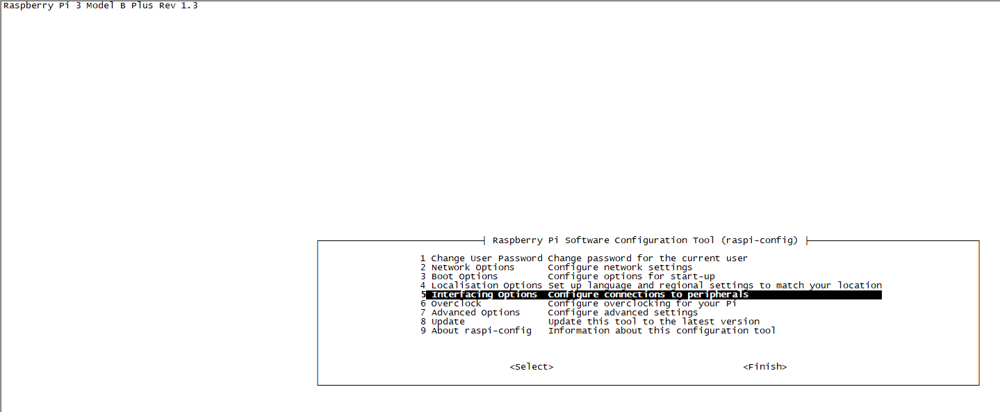

# 树莓派Raspberry 

# 一、简介

## 硬件配置


## GPIO引脚定义


## 各型号配置对比


## 各型号性能对比


# 二、基础配置

## 1、安装系统

树莓派官方出了一个快速在树莓派上安装OS的软件**NOOBS（ New Out Of Box Software）**，只需要将该软件刻录到SD卡上并在树莓派上启动，可在线或离线安装以下OS到您的树莓派上。

- **官方OS**：[Raspbian](http://raspbian.org/)

- **第三方OS**

  

**NOOBS下载地址**：https://www.raspberrypi.org/downloads/noobs/

**NOOBS刻录操作文档**：https://www.raspberrypi.org/documentation/installation/noobs.md

**NOOBS分为两个版本**：全功能版和轻量版Lite。全功能班可在线可离线安装OS。Lite只能在线安装OS

## 2、连接操作

- **直接通过HDMI外界显示进行操作**

- **通过SSH连接进行CLI操作**

- **通过VNC连接远程桌面进行操作**

  - 树莓派开启VNC服务，然后重启

    

  - chrome安装VNC Viewer插件进行连接，插件地址：https://www.realvnc.com/en/connect/download/viewer/chrome/

    

## 3、基础配置

### 连接隐藏wifi

- 编辑`/etc/wpa_supplicant/wpa_supplicant.conf `

  ```bash
  network={ 
    ssid=”wifi_name” 
    scan_ssid=1 
    psk=”wifi_password” 
  }
  # network：是一个连接WiFi网络的配置，可以有多个，wpa_supplicant会按照priority指定的优先级（数字越大越先连接）来连接，当然，在这个列表里面隐藏WiFi不受priority的影响，隐藏WiFi总是在可见WiFi不能连接时才开始连接。
  # ssid:网络的ssid
  # psk:密码
  # priority:连接优先级，越大越优先
  # scan_ssid:连接隐藏WiFi时需要指定该值为1
  ```

### CLI下配置Respbian

```bash
sudo raspi-config
```

