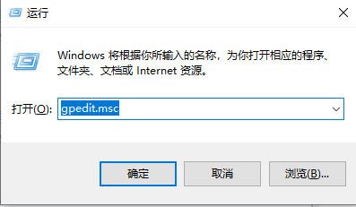
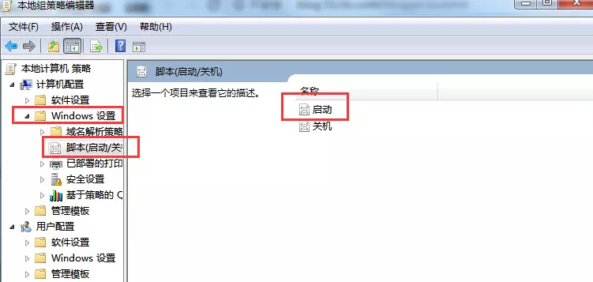
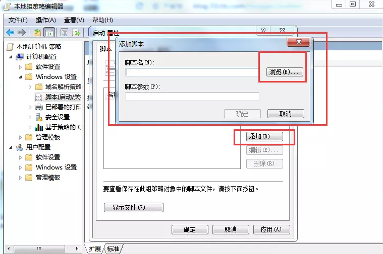
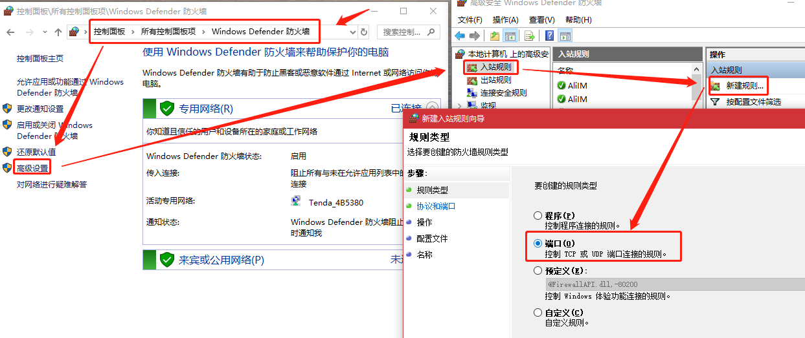
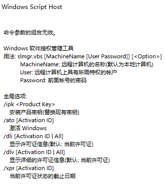
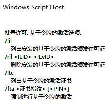
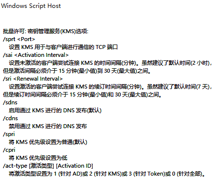
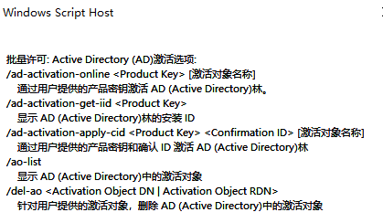

## 1. CMD下的换行符

    在CMD下,可以用^作为换行符,类似于Linux下的\

## 2. CMD下查看端口使用情况

    netstat -ano |findstr 8080

## 3. CMD下杀掉进程

    taskkill /pid 8080 -t -f

## 4. CMD下校验文件的MD5、SHA1、SHA256值

    certutil -hashfile yourfilename.ext MD5
    certutil -hashfile yourfilename.ext SHA1
    certutil -hashfile yourfilename.ext SHA256

## 5. CMD下激活windows系统

以管理员身份运行CMD

卸载之前的激活密钥

    slmgr -upk

设置KMS服务器

    slmgr -skms KMS服务器
​
常用的KMS服务器

    kms.03k.org
    kms.chinancce.com
    kms.lotro.cc
    cy2617.jios.org
    kms.shuax.com
    kms.luody.info
    kms.cangshui.net
    zh.us.to
    122.226.152.230
    kms.digiboy.ir
    kms.library.hk
    kms.bluskai.com

输入新的密钥

    slmgr -ipk 激活密钥

密钥

    win10专业版密钥
    W269N-WFGWX-YVC9B-4J6C9-T83GX
​
激活

    slmgr -ato

## 6. PowerShell下载文件

    $client = new-object System.Net.WebClient
    $client.DownloadFile('#1', '#2')
    # #1为下载链接 #2为文件保存的路径

**`Note`**：
- 一定要在路径中写上保存的新文件的全名（包括后缀）
- 建议保存的文件格式与下载的文件格式一致

## 7. 离线安装.NET Framework 3.5

**`Preflight`**
- windows 10 的系统ISO镜像
- 以管理员身份运行的CMD

将ISO镜像中source/sxs目录拷贝到某个路径下（以桌面为例）

在以管理员身份运行的CMD执行以下命令
    
    dism.exe /online /enable-feature /featurename:netfx3 /Source:C:\Users\user\Desktop\sxs

## 8. 添加开机自启动bat脚本

**`方法一`**：（推荐）

    将脚本放置“C:\Users\Curiouser\AppData\Roaming\Microsoft\Windows\Start Menu\Programs\Startup”路径下

**`方法二`**：

## 9. 修改远程桌面的默认端口3389

Windows+R,输入regedit，打开注册表，修改一下注册表的值(十进制)，然后重启远程桌面

    HKEY_LOCAL_MACHINE\System\CurrentControlSet\Control\Terminal Server\WinStations\RDP-Tcp\PortNumber

防火墙放行新指定的远程桌面端口

## 10. 防火墙放行指定端口

## 11. CMD下的用户管理

- `net user`：查看目前系统存在的用户
   `net user username`：查看用户的详细信息
- `whoami`：查看计算机当前登陆的用户
- `query user`：查看已登陆用户的详细信息
- `logoff+空格+ID号`：注销用户
- `net user 用户名 密码 /add`：新增本地用户
- `net localgroup administrators 用户名 /add`：将本地用户加入管理员用户组
- `net user 用户名 /del`：删除用户
- `runas /user:用户 cmd`：以某个用户运行命令

## 12. Windows软件授权管理工具slmgr命令

